# BusinessOS — System Architecture & Workflow

All-in-one business operating system for Bangladesh — a unified platform connecting products, inventory, orders, customers, POS, payments, warehouses, packaging, QR verification, courier, delivery, returns, finance, marketing, analytics and AI into a single business core.

**Online · Offline / POS · Omnichannel · Multi-tenant SaaS · AI-driven**

## Contents

- [1. Actors & external systems](#1-actors-and-external-systems)
- [2. Business registration & onboarding](#2-business-registration-and-onboarding)
- [3. Owner dashboard — central control center](#3-owner-dashboard-central-control-center)
- [4. Product management](#4-product-management)
- [5. Inventory management](#5-inventory-management)
- [6. Multi-warehouse / multi-branch](#6-multi-warehouse-multi-branch)
- [7. Omnichannel sales → central order engine](#7-omnichannel-sales-central-order-engine)
- [8. Customer lifecycle & segmentation](#8-customer-lifecycle-and-segmentation)
- [9. Order processing lifecycle](#9-order-processing-lifecycle)
- [10. QR packaging workflow](#10-qr-packaging-workflow)
- [11. Payment workflow](#11-payment-workflow)
- [12. Bangladesh courier layer](#12-bangladesh-courier-layer)
- [13. Return workflow & policy](#13-return-workflow-and-policy)
- [14. POS workflow](#14-pos-workflow)
- [15. Supplier & purchase workflow](#15-supplier-and-purchase-workflow)
- [16. Finance workflow](#16-finance-workflow)
- [17. Employee roles & audit log](#17-employee-roles-and-audit-log)
- [18. Notification system](#18-notification-system)
- [19. Marketing module](#19-marketing-module)
- [20. Analytics module](#20-analytics-module)
- [21. AI business engine & assistant](#21-ai-business-engine-and-assistant)
- [22. Reporting module](#22-reporting-module)
- [23. Platform admin panel](#23-platform-admin-panel)
- [24. Subscription system](#24-subscription-system)
- [25. Complete data flow](#25-complete-data-flow)
- [26. Multi-tenant architecture](#26-multi-tenant-architecture)
- [27. Technical architecture](#27-technical-architecture)
- [28. Master flow — order to delivery](#28-master-flow-order-to-delivery)

## Legend

- **Blue** — Actors / entry points
- **Purple** — Core process
- **Amber** — Decision point
- **Green** — Data / storage
- **Coral** — External system
- **Pink** — AI / automation

## 1. Actors & external systems

Four actor types interact with BusinessOS; sales and operational data flow in from external channels and out to payment, courier and notification providers.

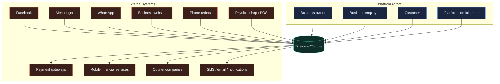

## 2. Business registration & onboarding

Every owner who signs up receives an isolated, multi-tenant workspace once payment and setup are complete.

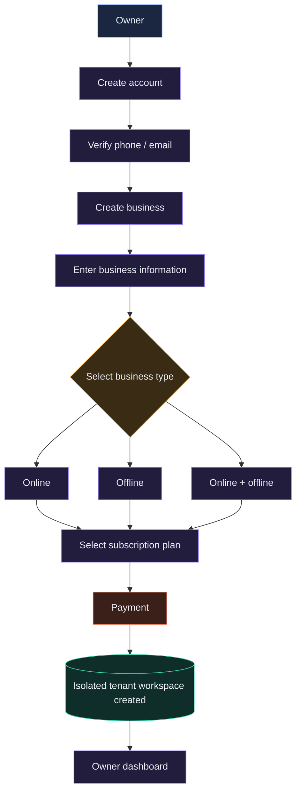

## 3. Owner dashboard — central control center

A single screen surfaces sales, stock, customer, courier, finance and AI signals, with every metric clickable through to its module.

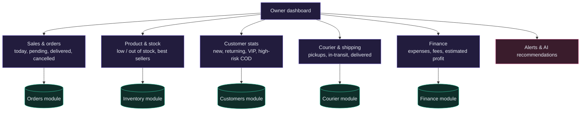

## 4. Product management

Products are created once and shared live across every sales channel, POS, inventory, orders and analytics — no duplication between systems.

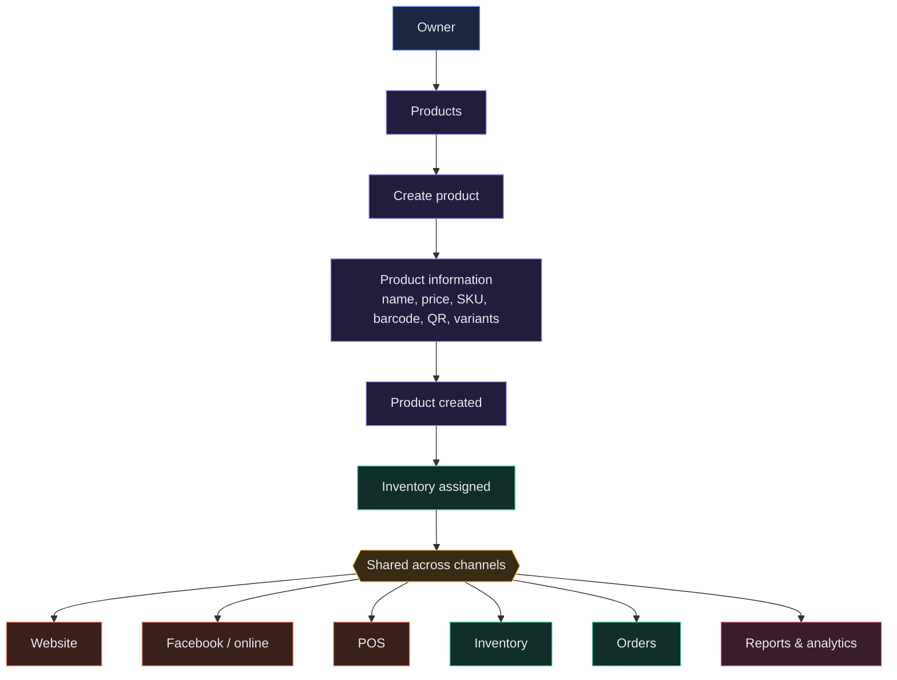

## 5. Inventory management

Stock moves through defined states and is recalculated in real time as sales land from any channel — for example, a base of 500 units minus 2 Facebook, 3 website and 1 POS sale, plus 1 return, always resolves to a single live available-stock number.

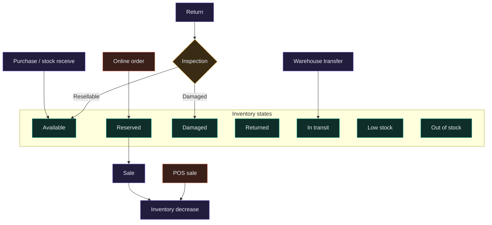

## 6. Multi-warehouse / multi-branch

Each location keeps its own stock ledger; transfers between locations require approval before the source decrements and destination increments.

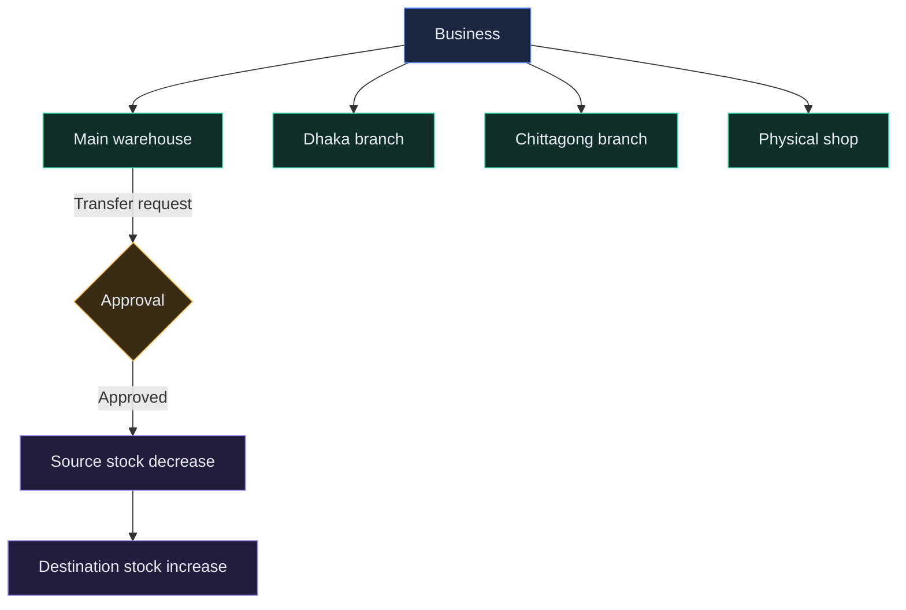

## 7. Omnichannel sales → central order engine

Every channel — Facebook, Messenger, WhatsApp, website, phone, POS, manual entry, API — feeds one standardized order record. There are no separate order systems per channel.

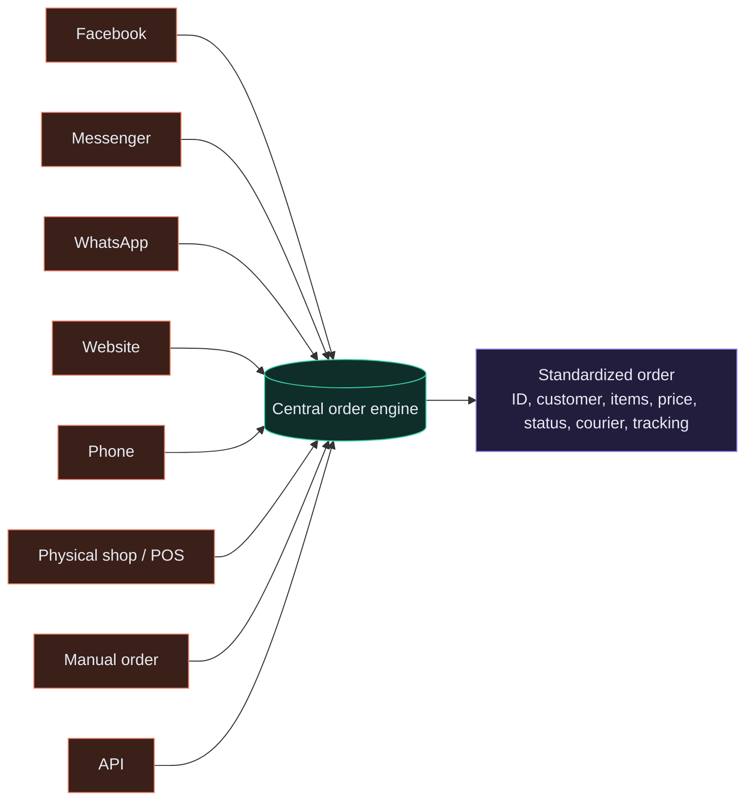

## 8. Customer lifecycle & segmentation

Every order updates the customer's profile and rolls up into an automatic segment used across marketing, risk scoring and AI.

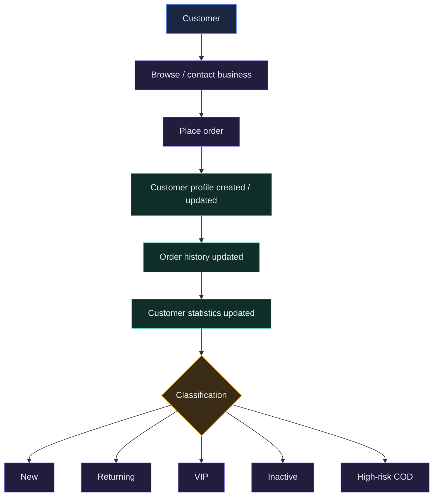

## 9. Order processing lifecycle

The full path from a placed order to a completed sale, plus the exception states that can break in at any stage.

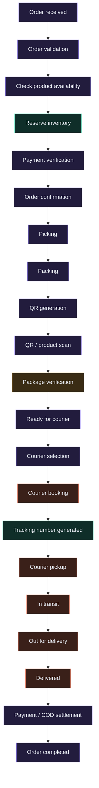

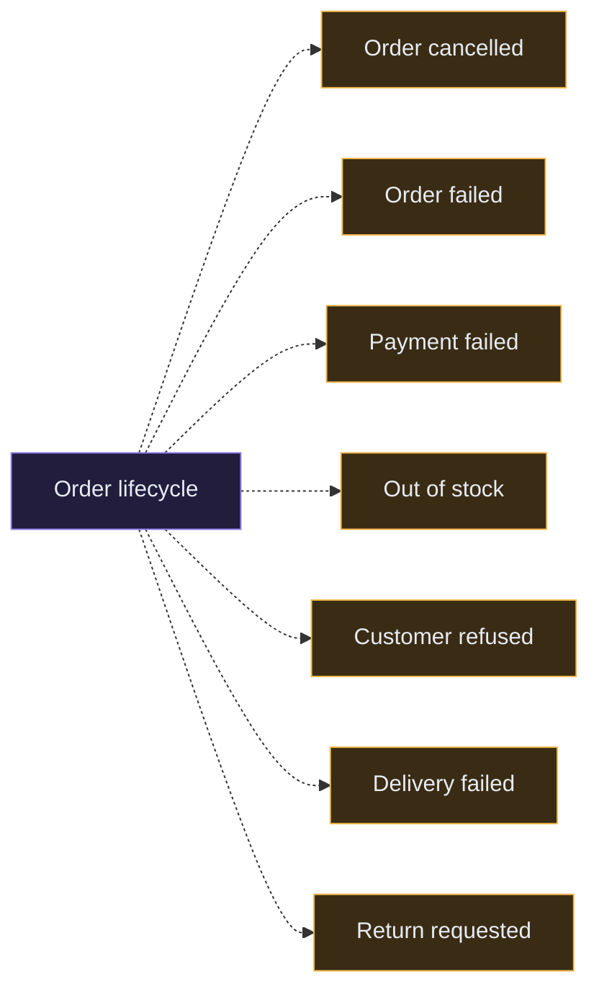

## 10. QR packaging workflow

Every package gets a unique QR that a warehouse worker scans, then verifies against scanned product barcodes before it is cleared for courier handoff.

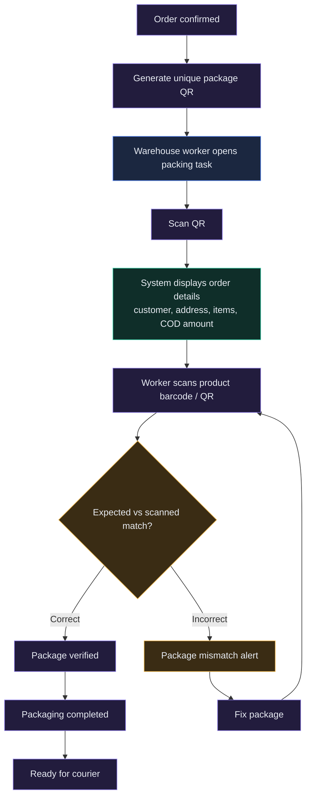

## 11. Payment workflow

Online payments settle through a gateway immediately; COD collects cash at delivery and settles back through the courier.

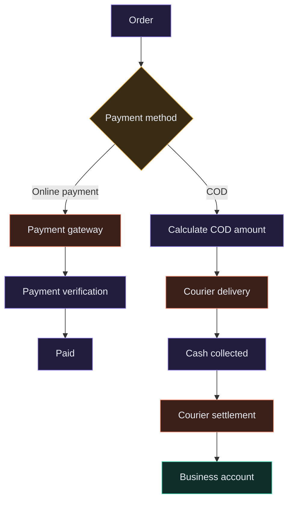

## 12. Bangladesh courier layer

A courier abstraction layer compares multiple providers on price, speed and success rate, then recommends one for owner approval before booking.

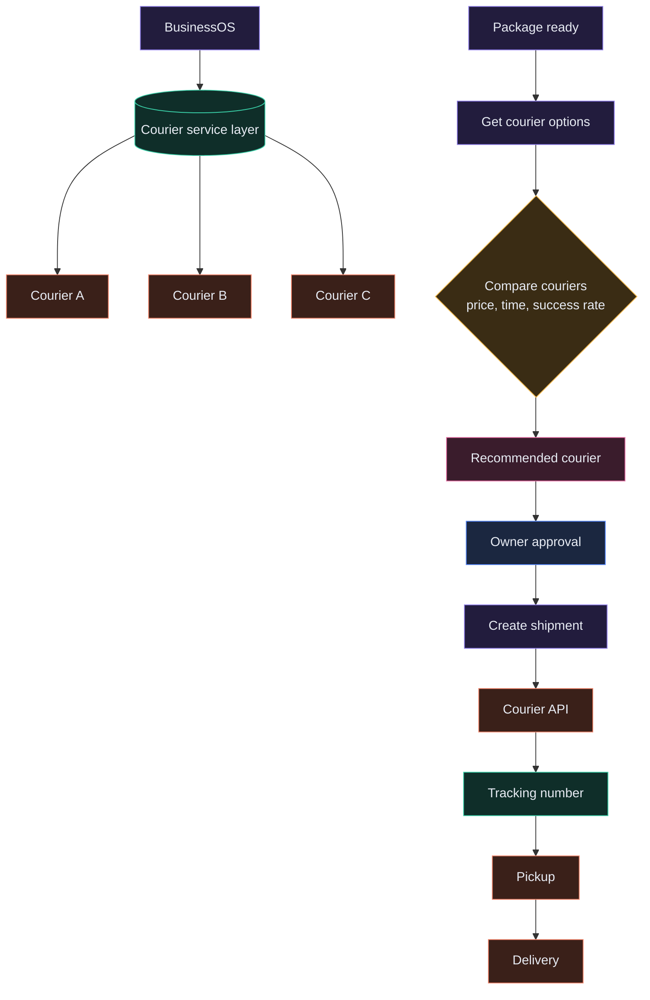

## 13. Return workflow & policy

Approved returns are inspected and routed back into available or damaged stock; every return updates order, inventory, customer, finance and analytics together.

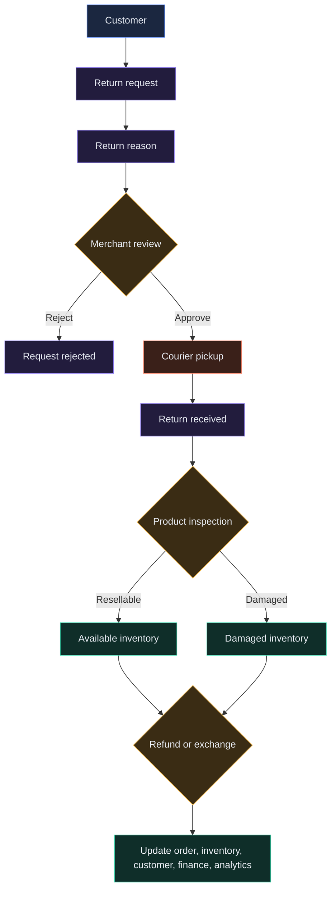

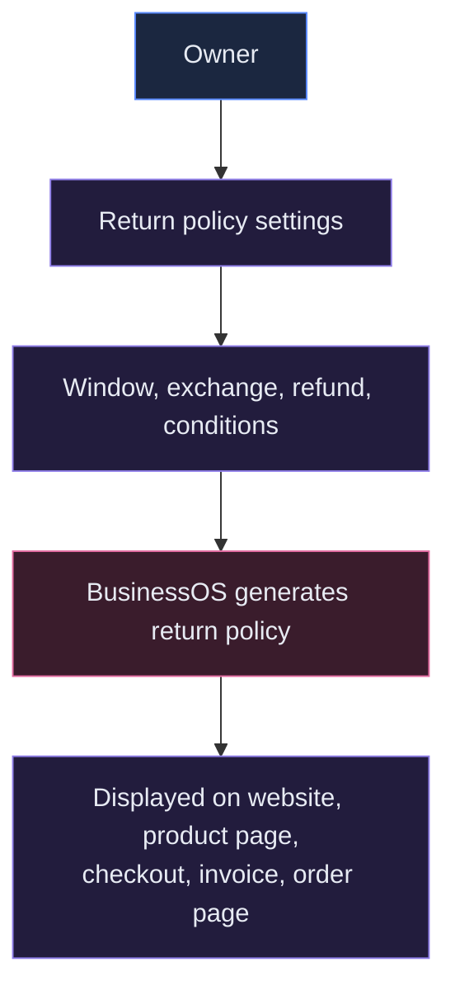

## 14. POS workflow

In-store sales run through the exact same order engine and inventory ledger as online sales — there is no separate POS database.

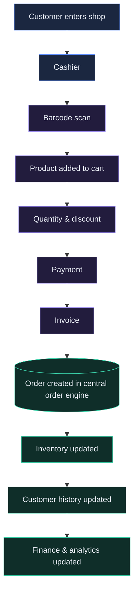

## 15. Supplier & purchase workflow

Low stock automatically triggers a reorder recommendation that the owner approves before it becomes a purchase order.

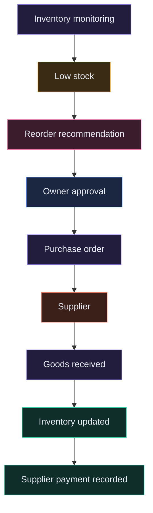

## 16. Finance workflow

Every cost and revenue stream — sales, product cost, expenses, courier fees, gateway fees, refunds, supplier payments, COD settlements — feeds one financial engine.

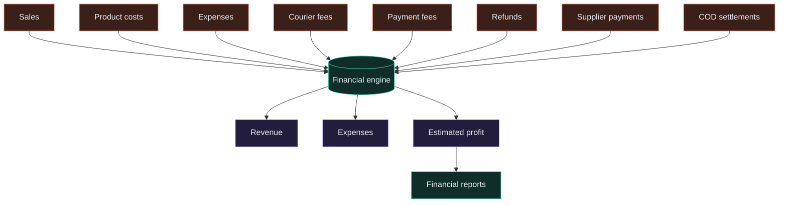

## 17. Employee roles & audit log

Every action is permission-gated by role, and every sensitive change is written to an immutable audit trail.

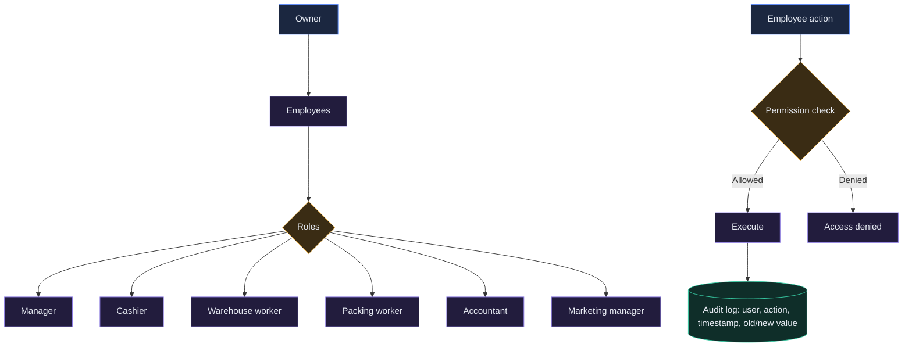

## 18. Notification system

A central notification engine fans key events out to owner, employee and customer across in-app, SMS, email and WhatsApp.

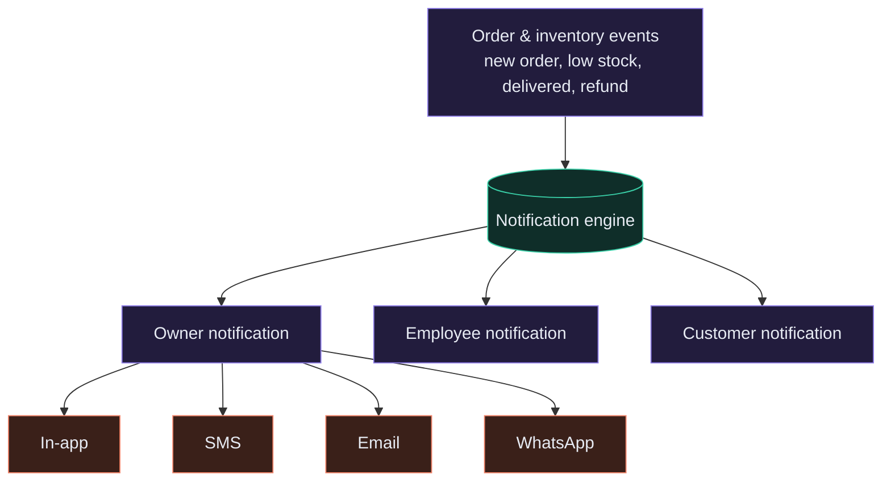

## 19. Marketing module

Customer segments drive targeted campaigns, coupons and offers, and every resulting purchase feeds back into analytics.

```mermaid
flowchart TD
  M1[Customer data]:::store --> M2{Segmentation}:::dec
  M2 --> M3[VIP]:::proc
  M2 --> M4[New]:::proc
  M2 --> M5[Inactive]:::proc
  M2 --> M6[Returning]:::proc
  M2 --> M7[High value]:::proc
  M3 --> M8[Marketing campaign]:::ai
  M4 --> M8
  M5 --> M8
  M6 --> M8
  M7 --> M8
  M8 --> M9[Coupon / discount / offer]:::proc
  M9 --> M10[Customer notification]:::ext
  M10 --> M11[Purchase]:::proc
  M11 --> M12[Analytics]:::store
  classDef actor fill:#1b2740,stroke:#5b8cff,color:#e7ebf3
  classDef proc fill:#221c3d,stroke:#8f7ee8,color:#e7ebf3
  classDef dec fill:#3a2c14,stroke:#f2b84b,color:#e7ebf3
  classDef store fill:#0f2e29,stroke:#3ad0a8,color:#e7ebf3
  classDef ext fill:#3a2019,stroke:#f0846a,color:#e7ebf3
  classDef ai fill:#3a1c2c,stroke:#e26ba0,color:#e7ebf3
```

## 20. Analytics module

Analytics span sales, product, inventory, customer, courier, returns, finance and channel performance in one engine.

```mermaid
flowchart TB
  AN[Analytics engine]:::store --> AN1[Sales analytics]:::proc
  AN --> AN2[Product analytics]:::proc
  AN --> AN3[Inventory analytics]:::proc
  AN --> AN4[Customer analytics]:::proc
  AN --> AN5[Courier & return analytics]:::proc
  AN --> AN6["Channel analytics<br/>Facebook, website, POS, phone"]:::proc
  AN --> AN7[Finance analytics]:::proc
  classDef actor fill:#1b2740,stroke:#5b8cff,color:#e7ebf3
  classDef proc fill:#221c3d,stroke:#8f7ee8,color:#e7ebf3
  classDef dec fill:#3a2c14,stroke:#f2b84b,color:#e7ebf3
  classDef store fill:#0f2e29,stroke:#3ad0a8,color:#e7ebf3
  classDef ext fill:#3a2019,stroke:#f0846a,color:#e7ebf3
  classDef ai fill:#3a1c2c,stroke:#e26ba0,color:#e7ebf3
```

## 21. AI business engine & assistant

The AI layer reads across orders, products, inventory, customers, courier and finance to power forecasting, risk scoring and a conversational assistant the owner can question directly.

```mermaid
flowchart TD
  D1[Orders]:::store --> AIC[(AI business engine)]:::ai
  D2[Products]:::store --> AIC
  D3[Inventory]:::store --> AIC
  D4[Customers]:::store --> AIC
  D5[Courier]:::store --> AIC
  D6[Finance]:::store --> AIC
  AIC --> F11[Demand forecasting]:::proc
  AIC --> F22[COD risk prediction]:::proc
  AIC --> F33[Courier recommendation]:::proc
  AIC --> F44[Anomaly detection]:::proc
  AIC --> F55[Restocking recommendation]:::proc
  OW[Owner]:::actor --> ASK[AI business assistant]:::ai
  ASK -->|Ask a business question| AIC
  AIC -->|Plain-language answer| OW
  classDef actor fill:#1b2740,stroke:#5b8cff,color:#e7ebf3
  classDef proc fill:#221c3d,stroke:#8f7ee8,color:#e7ebf3
  classDef dec fill:#3a2c14,stroke:#f2b84b,color:#e7ebf3
  classDef store fill:#0f2e29,stroke:#3ad0a8,color:#e7ebf3
  classDef ext fill:#3a2019,stroke:#f0846a,color:#e7ebf3
  classDef ai fill:#3a1c2c,stroke:#e26ba0,color:#e7ebf3
```

## 22. Reporting module

Every module can generate an exportable report in PDF, CSV or Excel.

```mermaid
flowchart LR
  RM[Reporting module]:::proc --> RP1b[Sales report]:::store
  RM --> RP2b[Inventory report]:::store
  RM --> RP3b[Customer report]:::store
  RM --> RP4b[Finance report]:::store
  RM --> RP5b[Employee activity report]:::store
  RP1b --> EXP{Export}:::dec
  EXP --> PDF[PDF]:::ext
  EXP --> CSV[CSV]:::ext
  EXP --> XLS[Excel]:::ext
  classDef actor fill:#1b2740,stroke:#5b8cff,color:#e7ebf3
  classDef proc fill:#221c3d,stroke:#8f7ee8,color:#e7ebf3
  classDef dec fill:#3a2c14,stroke:#f2b84b,color:#e7ebf3
  classDef store fill:#0f2e29,stroke:#3ad0a8,color:#e7ebf3
  classDef ext fill:#3a2019,stroke:#f0846a,color:#e7ebf3
  classDef ai fill:#3a1c2c,stroke:#e26ba0,color:#e7ebf3
```

## 23. Platform admin panel

Platform administrators manage the business of the platform itself — tenants, subscriptions, integrations, system health — without unrestricted access to merchant data.

```mermaid
flowchart TD
  PA[Platform administrator]:::actor --> AD1[Businesses]:::proc
  PA --> AD2[Users & subscriptions]:::proc
  PA --> AD3[Platform revenue]:::proc
  PA --> AD4[Courier & payment integrations]:::proc
  PA --> AD5[System health & security]:::proc
  PA --> AD6[Platform analytics]:::proc
  AD1 -. restricted access .-> MB[(Merchant business data)]:::store
  classDef actor fill:#1b2740,stroke:#5b8cff,color:#e7ebf3
  classDef proc fill:#221c3d,stroke:#8f7ee8,color:#e7ebf3
  classDef dec fill:#3a2c14,stroke:#f2b84b,color:#e7ebf3
  classDef store fill:#0f2e29,stroke:#3ad0a8,color:#e7ebf3
  classDef ext fill:#3a2019,stroke:#f0846a,color:#e7ebf3
  classDef ai fill:#3a1c2c,stroke:#e26ba0,color:#e7ebf3
```

## 24. Subscription system

Business type and plan tier together determine feature access and usage limits — products, orders, employees, warehouses, AI usage.

```mermaid
flowchart TD
  SB[Business]:::actor --> SP{Select plan}:::dec
  SP --> SPO[Online]:::proc
  SP --> SPF[Offline]:::proc
  SP --> SPB[Online + offline]:::proc
  SPO --> ST{Plan tier}:::dec
  SPF --> ST
  SPB --> ST
  ST --> TB[Basic]:::proc
  ST --> TP[Professional]:::proc
  ST --> TE[Enterprise]:::proc
  TB --> SPAY[Subscription payment]:::ext
  TP --> SPAY
  TE --> SPAY
  SPAY --> FA[Feature access & usage limits]:::store
  classDef actor fill:#1b2740,stroke:#5b8cff,color:#e7ebf3
  classDef proc fill:#221c3d,stroke:#8f7ee8,color:#e7ebf3
  classDef dec fill:#3a2c14,stroke:#f2b84b,color:#e7ebf3
  classDef store fill:#0f2e29,stroke:#3ad0a8,color:#e7ebf3
  classDef ext fill:#3a2019,stroke:#f0846a,color:#e7ebf3
  classDef ai fill:#3a1c2c,stroke:#e26ba0,color:#e7ebf3
```

## 25. Complete data flow

The backbone chain that every transaction updates automatically, end to end.

```mermaid
flowchart LR
  PR[Product]:::store --> IN[Inventory]:::store --> OR[Order]:::store --> CU2[Customer]:::store --> PA2[Payment]:::store --> PK2[Packaging]:::proc --> QR2[QR]:::proc --> CR2[Courier]:::ext --> DL[Delivery]:::ext --> SE[Settlement]:::proc --> FI2[Finance]:::store --> ANL[Analytics]:::store --> AIF[AI]:::ai
  classDef actor fill:#1b2740,stroke:#5b8cff,color:#e7ebf3
  classDef proc fill:#221c3d,stroke:#8f7ee8,color:#e7ebf3
  classDef dec fill:#3a2c14,stroke:#f2b84b,color:#e7ebf3
  classDef store fill:#0f2e29,stroke:#3ad0a8,color:#e7ebf3
  classDef ext fill:#3a2019,stroke:#f0846a,color:#e7ebf3
  classDef ai fill:#3a1c2c,stroke:#e26ba0,color:#e7ebf3
```

## 26. Multi-tenant architecture

Every business operates in a fully isolated workspace, partitioned by tenant ID throughout the stack — Business A can never see Business B's data.

```mermaid
flowchart TD
  PL[Platform]:::store --> BA[Business A]:::proc
  PL --> BB[Business B]:::proc
  PL --> BC[Business C]:::proc
  BA --> BA1["Users, products, orders,<br/>customers, inventory, finance"]:::store
  BB --> BB1["Users, products, orders,<br/>customers, inventory, finance"]:::store
  BC --> BC1["Users, products, orders,<br/>customers, inventory, finance"]:::store
  classDef actor fill:#1b2740,stroke:#5b8cff,color:#e7ebf3
  classDef proc fill:#221c3d,stroke:#8f7ee8,color:#e7ebf3
  classDef dec fill:#3a2c14,stroke:#f2b84b,color:#e7ebf3
  classDef store fill:#0f2e29,stroke:#3ad0a8,color:#e7ebf3
  classDef ext fill:#3a2019,stroke:#f0846a,color:#e7ebf3
  classDef ai fill:#3a1c2c,stroke:#e26ba0,color:#e7ebf3
```

## 27. Technical architecture

A modular monolith to start, with clean module boundaries so high-load components — order processing, AI, courier integration — can split into services later.

```mermaid
flowchart TB
  FE2["Frontend<br/>React, Vite, Tailwind CSS"]:::proc --> BE2["Backend<br/>Node.js, NestJS / Express"]:::proc
  BE2 --> DBs[(PostgreSQL)]:::store
  BE2 --> CA2[(Redis cache)]:::store
  BE2 --> ST2[(Object storage)]:::store
  BE2 --> Q2[(Queue / worker jobs)]:::store
  BE2 --> AISV["AI service<br/>Python / FastAPI"]:::ai
  BE2 --> EXT2["External APIs<br/>payment, courier, Meta, SMS/Email"]:::ext
  classDef actor fill:#1b2740,stroke:#5b8cff,color:#e7ebf3
  classDef proc fill:#221c3d,stroke:#8f7ee8,color:#e7ebf3
  classDef dec fill:#3a2c14,stroke:#f2b84b,color:#e7ebf3
  classDef store fill:#0f2e29,stroke:#3ad0a8,color:#e7ebf3
  classDef ext fill:#3a2019,stroke:#f0846a,color:#e7ebf3
  classDef ai fill:#3a1c2c,stroke:#e26ba0,color:#e7ebf3
```

## 28. Master flow — order to delivery

The single highlighted flow the whole platform is built around: a customer's intent becomes revenue, inventory truth, and an AI insight, no matter which door they walked in through.

```mermaid
flowchart TD
  X1[Customer]:::actor --> X2["Facebook / website / phone / POS"]:::ext
  X2 --> X3[Central order engine]:::store
  X3 --> X4[Customer validation]:::proc
  X4 --> X5[Inventory check & reservation]:::store
  X5 --> X6[Payment]:::proc
  X6 --> X7[Order confirmation]:::proc
  X7 --> X8[Picking & packaging]:::proc
  X8 --> X9[QR generation & scan verification]:::proc
  X9 --> X10[Courier selection & booking]:::ext
  X10 --> X11["Pickup → in transit → out for delivery"]:::ext
  X11 --> X12[Delivered]:::ext
  X12 --> X13[COD settlement]:::proc
  X13 --> X14["Finance, customer, inventory, analytics updated"]:::store
  X14 --> X15[AI learning & insights]:::ai
  classDef actor fill:#1b2740,stroke:#5b8cff,color:#e7ebf3
  classDef proc fill:#221c3d,stroke:#8f7ee8,color:#e7ebf3
  classDef dec fill:#3a2c14,stroke:#f2b84b,color:#e7ebf3
  classDef store fill:#0f2e29,stroke:#3ad0a8,color:#e7ebf3
  classDef ext fill:#3a2019,stroke:#f0846a,color:#e7ebf3
  classDef ai fill:#3a1c2c,stroke:#e26ba0,color:#e7ebf3
```

The offline path runs the same core loop with a shorter front end:

```mermaid
flowchart LR
  Y1[Customer enters shop]:::actor --> Y2[POS]:::ext --> Y3[Barcode scan]:::proc --> Y4[Payment]:::proc --> Y5[Invoice]:::proc --> Y6[Central order engine]:::store --> Y7[Inventory update]:::store --> Y8[Finance]:::store --> Y9[Customer]:::store --> Y10[Analytics]:::store
  classDef actor fill:#1b2740,stroke:#5b8cff,color:#e7ebf3
  classDef proc fill:#221c3d,stroke:#8f7ee8,color:#e7ebf3
  classDef dec fill:#3a2c14,stroke:#f2b84b,color:#e7ebf3
  classDef store fill:#0f2e29,stroke:#3ad0a8,color:#e7ebf3
  classDef ext fill:#3a2019,stroke:#f0846a,color:#e7ebf3
  classDef ai fill:#3a1c2c,stroke:#e26ba0,color:#e7ebf3
```

---

*BusinessOS — architecture & workflow reference · generated diagram document*